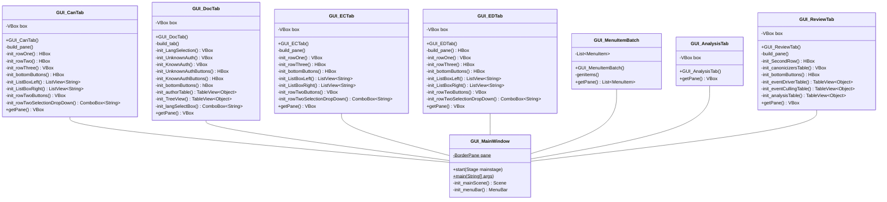

# GUI Design

## GUI Top-Level Diagram

```mermaid
classDiagram
    GUI_CanTab -- GUI_MainWindow
    GUI_DocTab -- GUI_MainWindow
    GUI_ECTab -- GUI_MainWindow
    GUI_EDTab -- GUI_MainWindow
    GUI_MenuItemBatch -- GUI_MainWindow
    GUI_AnalysisTab -- GUI_MainWindow
    GUI_ReviewTab -- GUI_MainWindow

    class GUI_CanTab{
        -VBox box
        +GUI_CanTab()
        -build_pane()
        -init_rowOne() HBox
        -init_rowTwo() HBox
        -init_rowThree() VBox
        -init_bottomButtons() HBox
        -init_ListBoxLeft() ListView~String~
        -init_ListBoxRight() ListView~String~
        -init_rowTwoButtons() VBox
        -init_rowTwoSelectionDropDown() ComboBox~String~
        +getPane() VBox
    }
    class GUI_DocTab{
        -VBox box
        +GUI_DocTab()
        -build_tab()
        -init_LangSelection() VBox
        -init_UnknownAuth() VBox
        -init_KnownAuth() VBox
        -init_UnknownAuthButtons() HBox
        -init_KnownAuthButtons() HBox
        -init_bottomButtons() hBox
        -init_authorTable() TableView~Object~
        -init_TreeView() TableView~Object~
        -init_langSelectBox() ComboBox~String~
        +getPane() VBox
    }
    class GUI_ECTab{
        -VBox box
        +GUI_ECTab()
        -build_pane()
        -init_rowOne() VBox
        -init_rowThree() HBox
        -init_bottomButtons() HBox 
        -init_ListBoxLeft() ListView~String~
        -init_ListBoxRight() ListView~String~
        -init_rowTwoButtons() VBox
        -init_rowTwoSelectionDropDown() ComboBox~String~
        +getPane() VBox
    }
    class GUI_EDTab{
        -VBox box
        +GUI_EDTab()
        -build_pane() HBox
        -init_rowOne() VBox
        -init_rowThree() HBox
        -init_bottomButtons() HBox
        -init_ListBoxLeft() ListView~String~
        -init_ListBoxRight() ListView~String~
        -init_rowTwoButtons() VBox
        -init_rowTwoSelectionDropDown() ComboBox~String~
        +getPane() VBox
    }
    class GUI_MainWindow{
        -BorderPane pane$
        +start(Stage mainstage)
        +main(String[] args)$
        -init_mainScene() Scene
        -init_menuBar() MenuBar

    }
    class GUI_MenuItemBatch{
        -List~MenuItem~
        +GUI_MenuItemBatch()
        -genItems()
        +getPane() List~MenuItem~
    }
    class GUI_AnalysisTab{
        -VBox box
        +GUI_AnalysisTab()
        +getPane() VBox
    }
    class GUI_ReviewTab{
        -VBox box
        +GUI_ReviewTab()
        -build_pane()
        -init_SecondRow() HBox
        -init_canonicizersTable() VBox
        -init_bottomButtons() HBox
        -init_eventDriverTable() TableView~Object~
        -init_eventCullingTable() TableView~Object~
        -init_analysisTable() TableView~Object~
        +getPane() VBox
    }
```

## Dependencies

[JavaFX version 21](https://openjfx.io/)

[Java version 21](https://www.oracle.com/java/technologies/downloads/#java21)
