# GUI Design

## GUI Top-Level Diagram

```mermaid
classDiagram

    GUI_CanTab -- GUI_MainWindow
    GUI_DocTab -- GUI_MainWindow
    GUI_ECTab -- GUI_MainWindow
    GUI_EDTab -- GUI_MainWindow
    GUI_MenuItemBatch -- GUI_MainWindow
    GUI_AnalysisTab -- GUI_MainWindow
    GUI_ReviewTab -- GUI_MainWindow
    GUI_NotesWindow -- GUI_MainWindow
    GUI_NotesWindow -- GUI_CanTab
    GUI_NotesWindow -- GUI_DocTab
    GUI_NotesWindow -- GUI_ECTab
    GUI_NotesWindow -- GUI_EDTab
    GUI_NotesWindow -- GUI_AnalysisTab
    GUI_JGAAPAboutWindow -- GUI_MainWindow
    GUI_AddAuthor -- GUI_DocTab
    GUI_ResultsWindow -- GUI_ReviewTab

    class GUI_CanTab{
        -GUI_NotesWindow notesBox$
        -VBox box
        +GUI_CanTab()
        -build_pane()
        -init_rowOne() HBox
        -init_rowTwo() VBox
        -init_bottomButtons() HBox
        -init_ListBoxLeft() ListView~String~
        -init_ListBoxRight() ListView~String~
        -init_rowTwoButtons() VBox
        -init_rowTwoSelectionDropDown() ComboBox~String~
        +getPane() VBox
    }
    class GUI_DocTab{
        -GUI_NotesWindow notesBox$
        -VBox box
        +GUI_DocTab()
        -build_tab()
        -init_LangSelection() VBox
        -init_UnknownAuth() VBox
        -init_KnownAuth() VBox
        -init_UnknownAuthButtons() HBox
        -init_KnownAuthButtons() HBox
        -init_bottomButtons() hBox
        -init_authorTable() TableView~Object~
        -init_TreeView() TableView~Object~
        -init_langSelectBox() ComboBox~String~
        +getPane() VBox
    }
    class GUI_ECTab{
        -GUI_NotesWindow notesBox$
        -VBox box
        +GUI_ECTab()
        -build_pane()
        -init_rowOne() HBox
        -init_rowTwo() VBox
        -init_bottomButtons() HBox 
        -init_ListBoxLeft() ListView~String~
        -init_ListBoxRight() ListView~String~
        -init_rowTwoButtons() VBox
        -init_rowTwoSelectionDropDown() ComboBox~String~
        +getPane() VBox
    }
    class GUI_EDTab{
        -GUI_NotesWindow notesBox$
        -VBox box
        +GUI_EDTab()
        -build_pane() HBox
        -init_rowOne() HBox
        -init_rowTwo() VBox
        -init_bottomButtons() HBox
        -init_ListBoxLeft() ListView~String~
        -init_ListBoxRight() ListView~String~
        -init_rowTwoButtons() VBox
        -init_rowTwoSelectionDropDown() ComboBox~String~
        +getPane() VBox
    }
    class GUI_MainWindow{
        -BorderPane pane$
        +start(Stage mainstage)
        +main(String[] args)$
        -init_mainScene() Scene
        -init_menuBar() MenuBar
    }
    class GUI_MenuItemBatch{
        -List~MenuItem~ items
        -List~MenuItem~ problems
        +GUI_MenuItemBatch()
        -genItems()
        -genProblems()
        +getItems() List~MenuItem~
        +getproblems() List~MenuItem~
    }
    class GUI_AnalysisTab{
        -VBox box;
        -GUI_NotesWindow notesBox$
        +GUI_AnalysisTab()
        -build_pane()
        -init_rowOne() HBox
        -init_rowTwo() HBox
        -init_bottomButtons() HBox
        -init_SelectedBox() ListView~String~
        -init_AnalysisMethodBox() ListView~String~
        -init_DistanceFunctionBox() ListView~String~
        -init_rowOneButtons() VBox
        +getPane() VBox
    }
    class GUI_ReviewTab{
        -GUI_NotesWindow notesBox$
        -VBox box
        +GUI_ReviewTab()
        -build_pane()
        -init_SecondRow() HBox
        -init_canonicizersTable() VBox
        -init_bottomButtons() HBox
        -init_eventDriverTable() TableView~Object~
        -init_eventCullingTable() TableView~Object~
        -init_analysisTable() TableView~Object~
        +getPane() VBox
    }
    class GUI_NotesWindow{
        -Stage stage$
        -Button notes$
        -TextArea area$
        -String text$
        +GUI_NotesWindow()
        -build_stage()
        -init_bottomButtons() HBox
        +getButton() Button
        +getNotes () String
        +show()
        +hide()
        +close()
    }
    class GUI_JGAAPAboutWindow{
        -Stage stage$
        +GUI_JGAAPAboutWindow()
        -build_stage()
        +show()
    }
    class GUI_AddAuthor{

    }
    class GUI_ResultsWindow{

    }
```

## Dependencies

[JavaFX version 21](https://openjfx.io/)

[Java version 21](https://www.oracle.com/java/technologies/downloads/#java21)

## Launching

For the time being please launch via commandline or a debugger. If using a commandline please use the following: `java --module-path=<JavaFX_SDK_PATH>/lib --add-modules=javafx.controls,javafx.fxml,javafx.graphics,javafx.base,javafx.swing -jar <path_to-jar>.jar`
